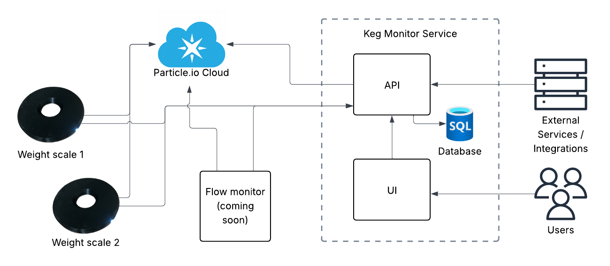

# DIY Keg Volume Monitors

While there are many commercially available monitors for kegs out there, this project is designed for the DIY/tinkerer at heart and aimed to be a more cost effective way to add volume monitors to your kegs.  The core of these monitors is the particle.io Photon 2 micro-controller.  This low cost micro-controller adds Wifi and BluetoothLE support as well and integrated cloud.  This allows the keg monitor service to get stats and execute functions against the devices even when they are not on the same network. The particle.io cloud is free (for up to 100 devices) so it makes it perfect for this type of DIY project.  While there are cheaper micro-controllers out there, the Photon 2 was chosen because its extra features were worth the extra few dollars.

## Monitors

- [Weight Scale](./monitors/weight/README.md): Monitors the volume of the keg based on the current weight.
- Flow Monitor _(coming soon)_: Monitors the remaining volume in the keg bacged on how much liquid flowed through the sensors.

## The web service

The core of all of this is the web service.  This offers an API, both for the devices to post too, as well as external services to integrate with.  There is also a light weight UI for viewing the status of and managing the devices.  The service also proxies the calls to particle cloud to execute certain functions on the different devices.

## Whats next?

See our [issues page](https://github.com/alanquillin/keg-volume-monitors/issues) for upcoming milestones and changes on our roadmap.
