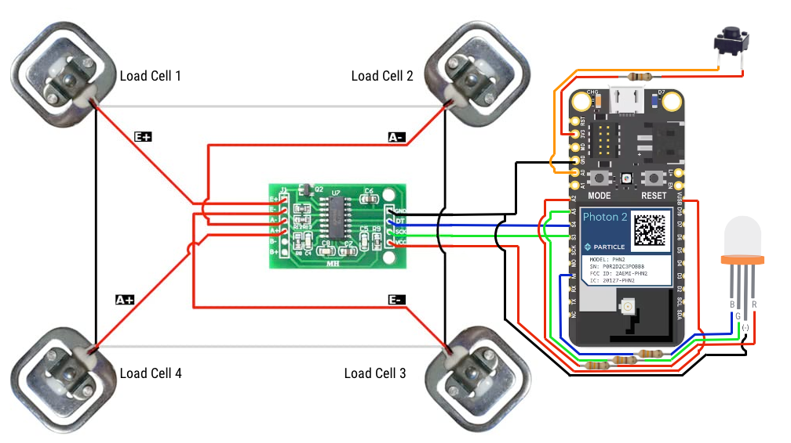

# Weight Based Keg Volume Monitor

Inspired by the now discontinued Plaato keg, this monitor uses the weight of the keg over time ter determine the current
 volume based on the weight of the empty keg and the weight of a full keg.  I love the Plaato keg, and was sad when they
 annouced their pivot away from home brewing gear and would no longer be selling, innovating or supporting the Plaato
 keg.  In my search I found a few other DIY clones using low cost hardware and existing technologies.  However, I wanted
 to build some truly DIY and fully opensource.  So I designed my own keg scale using the Particle Photon 2 platform.

## Parts required

- [Particle Photon2](https://store.particle.io/products/photon-2) (optionally will work with discontinued Photon or Argon)
- [4 Load Cells w/ HX711 amplifier](https://www.amazon.com/Bridge-Digital-Amplifier-Arduino-DIYmalls/dp/B086ZHXNJH)
- [5mm RGB Led (common cathode)](https://www.amazon.com/PATIKIL-Emitting-Mounting-Bracket-Transparent/)
- 3X 330 ohm Resistor
- [5mm LED holder](https://www.amazon.com/PATIKIL-Emitting-Mounting-Bracket-Transparent/dp/B0C54Y99NQ)

### Optional components

- Micro USB cable (is using the optinal riser boards below, I would recommend a cable with extremely slim connectors
like [these](https://www.amazon.com/dp/B09XKYP32W).  The .stl files for the case add additional room for the cables, but its better to be safe than sorry ;P)
- [6mmX6mm single pole push button switch](https://www.amazon.com/dp/B07WF76VHT)
- 10k Ohm resistor

#### Optional Parts for custom riser boards

I have added the [EAGLE files](./eagle) to manufacture helper riser boards simplify and cleanup the internal wiring.  Please [contact me](mailto:alanquillin@gmail.com) for more information. 

- JST-PH connectors
  - 4 pole connectors
    - 3 X [S4B-PH-K-S](https://www.digikey.com/en/products/detail/jst-sales-america-inc/S4B-PH-K-S/926628) right angle female through hole solder connectors
    - 1 X [B4B-PH-K-S](https://www.digikey.com/en/products/detail/jst-sales-america-inc/B4B-PH-K-S/926613) straight female through hole solder connector
    - 8 X [PHR-4](https://www.digikey.com/en/products/detail/jst-sales-america-inc/PHR-4/608606) male connectors
  - 3 pole
    - 4 X [S3B-PH-K-S](https://www.digikey.com/en/products/detail/jst-sales-america-inc/S3B-PH-K-S/926627) female through hole solder connectors
    - 8 X [PHR-3](https://www.digikey.com/en/products/detail/jst-sales-america-inc/PHR-3/527357) male connectors
  - 2 pole
    - 2 X [S2B-PH-K-S](https://www.digikey.com/en/products/detail/jst-sales-america-inc/S2B-PH-K-S/926626) female through hole solder connectors
    - 4 X [PHR-2](https://www.digikey.com/en/products/detail/jst-sales-america-inc/PHR-2/608607) male connectors
  - 20 X [SPH-004](https://www.digikey.com/en/products/detail/jst-sales-america-inc/SPH-004T-P0-5S/608759) crimp terminal pins
- [2m X 6MM self taping screws](https://www.amazon.com/dp/B01KXS7TOI).  The STLs do not have pre-drilled holed for the screws to hold the circuit boards, and thats because the risers are not perfect ;P, so self taping screws will allow you to screw right into the solid plastic.

## Links

- [Another DIY Plaato Keg clone](https://www.youtube.com/watch?v=QF1B8yD9jy4) from the [Trouble Brewing](https://www.youtube.com/@TroubleBrewing) 
YouTube channel.  This one uses a NodeMCU 8266 module and Home Assistant Server.  However, I am not a huge fan of these modules or Home Assistant
and I wanted to build something fully opensource.
- [Wiring up and calibrating HX711 with 4 load cell using arduino](https://www.youtube.com/watch?v=LIuf2egMioA)
